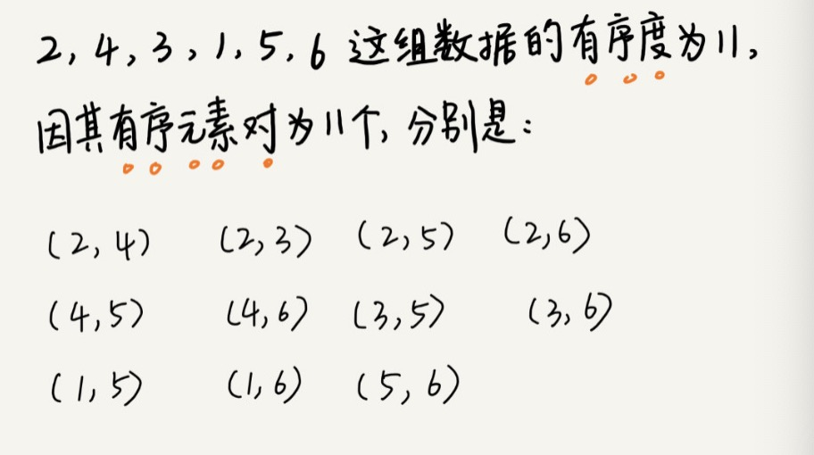

- 算法
    - [选择排序](/algo/selection)

## 如何分析一个“排序算法”？

##### 排序算法的执行效率
1. 最好情况、最坏情况、平均情况时间复杂度
> 有序度不同的数据，对于排序的执行时间是有影响的，我们要知道排序算法在不同数据下的性能表现。
2. 时间复杂度的系数、常数 、低阶
> 在对同一阶时间复杂度的排序算法性能对比的时候，我们就要把系数、常数、低阶也考虑进来
3. 比较次数和交换（或移动）次数
> 基于比较的排序算法的执行过程，会涉及两种操作，一种是元素比较大小，另一种是元素交换或移动。所以分析排序算法的执行效率的时候，应该把比较次数和交换（或移动）次数也考虑进去。

#####  排序算法的内存消耗
- **原地排序**算法，就是特指空间复杂度是 O(1) 的排序算法

##### 排序算法的稳定性

- 如果待排序的序列中存在值相等的元素，经过排序之后，相等元素之间原有的先后顺序不变,被称为**稳定的排序算法**

## 有序度

**有序度**是数组中具有有序关系的元素对的个数

- **有序**元素对：a[i] <= a[j], 如果i < j。

- **逆序**元素对：a[i] > a[j], 如果i < j。

- 1，2，3，4，5，6，有序度就是 n*(n-1)/2，也就是 15。我们把这种完全有序的数组的有序度叫作**满有序度**。