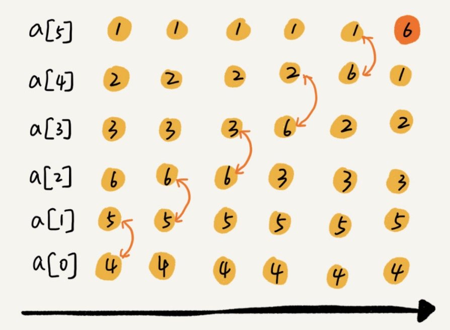

## 算法思想

冒泡排序只会操作相邻的两个数据。每次冒泡操作都会对相邻的两个元素进行比较，看是否满足大小关系要求。如果不满足就让它俩互换。一次冒泡会让至少一个元素移动到它应该在的位置，重复 n 次，就完成了 n 个数据的排序工作。

## 算法图解

> 下图为一次冒泡的结果



## 实现

```javascript
// 冒泡排序
const bubbleSort = (arr) => {
    if (arr.length <= 1) return
    for (let i = 0; i < arr.length; i++) {
        let hasChange = false
        for (let j = 0; j < arr.length - i - 1; j++) {
            if (arr[j] > arr[j + 1]) {
                const temp = arr[j]
                arr[j] = arr[j + 1]
                arr[j + 1] = temp
                hasChange = true
            }
        }
        // 如果false 说明所有元素已经到位
        if (!hasChange) break
    }
    console.log(arr)
}
```
## 分析

1. 冒泡排序为原地排序算法
2. 冒泡排序为稳定排序

> 冒泡排序中两个元素大小相等的时候，不交换顺序

3. 冒泡排序最好情况时间复杂度为O(n),最坏时间复杂度和平均时间复杂度都为O(n<sup>2</sup>)