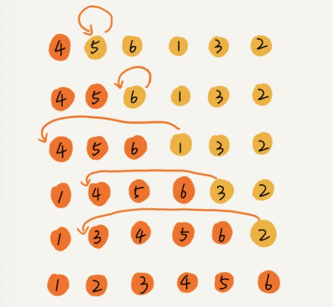

# 插入排序

## 算法思想

将数组分为已排序区间和未排序区间。插入算法的核心思想是取未排序区间中的元素，在已排序区间中找到合适的插入位置将其插入，并保证已排序区间数据一直有序。

## 算法图解

> 下图中，橙色代表已经排序，黄色代表未排序



## 算法实现

```javascript
const insertionSort = (arr) => {
    if (arr.length <= 1) return
    for (let i = 1; i < arr.length; i++) {
        const temp = arr[i]
        let j = i - 1
        // 若arr[i]前有大于arr[i]的值的化，向后移位，腾出空间，直到一个<=arr[i]的值
        for (j; j >= 0; j--) {
            if (arr[j] > temp) {
                arr[j + 1] = arr[j]
            } else {
                break
            }
        }
        arr[j + 1] = temp
    }
    return arr
}
```

## 分析

对于不同的查找插入点方法（**从头到尾、从尾到头**），元素的**比较次数**是有区别的。但对于一个给定的初始序列，**移动操作的次数总是固定的，就等于逆序度**。

1. 插入排序是原地排序算法
2. 插入排序是稳定的排序算法
3. 插入排序的时间复杂度: **从尾到头遍历已经有序的数据**为O(n), 最坏和平均时间复杂度为O(n<sup>2</sup>)