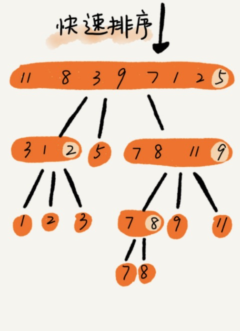

# 快速排序

## 算法思想

如果要排序数组中下标从 p 到 r 之间的一组数据，我们选择 p 到 r 之间的任意一个数据作为 pivot（分区点）。我们遍历 p 到 r 之间的数据，将小于 pivot 的放到左边，将大于 pivot 的放到右边，将 pivot 放到中间。经过这一步骤之后，数组 p 到 r 之间的数据就被分成了三个部分，前面 p 到 q-1 之间都是小于 pivot 的，中间是 pivot，后面的 q+1 到 r 之间是大于 pivot 的

## 算法图解



## 算法实现

```javascript
const swap = (arr, i, j) => {
    const temp = arr[i]
    arr[i] = arr[j]
    arr[j] = temp
}

// 获取 pivot 交换完后的index
const partition = (arr, pivot, left, right) => {
    const pivotVal = arr[pivot]
    let startIndex = left
    for (let i = left; i < right; i++) {
        if (arr[i] < pivotVal) {
            swap(arr, i, startIndex)
            startIndex++
        }
    }
    swap(arr, startIndex, pivot)
    return startIndex
}

const quickSort = (arr, left, right) => {
    if (left < right) {
        let pivot = right
        let partitionIndex = partition(arr, pivot, left, right)
        quickSort(arr, left, partitionIndex - 1 < left ? left : partitionIndex - 1)
        quickSort(arr, partitionIndex + 1 > right ? right : partitionIndex + 1, right)
    }

}
```

## 算法分析

1. 快速排序**原地**排序算法
2. 快速排序是**不稳定**的排序算法。比如序列 6，8，7，6，3，5，9，4，在经过第一次分区操作之后，两个 6 的相对先后顺序就会改变。
3. 快速排序的时间复杂度: **O(nlogn)**