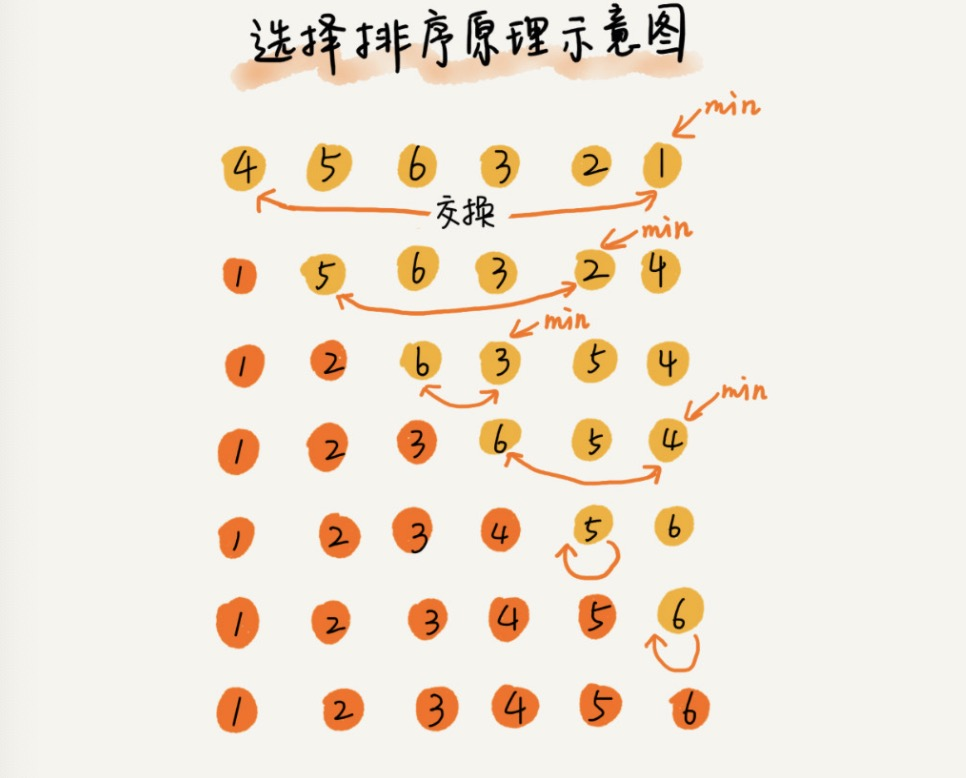

# 选择排序

## 算法思想

1. 在要排序的一组数中，选出最小（或者最大）的一个数与第1个位置的数交换
2. 然后在剩下的数当中再找最小（或者最大）的与第2个位置的数交换
3. 以此类推，直到第n-1个元素（倒数第二个数）和第n个元素（最后一个数）比较为止

选择排序分排序区间和未排序区间。选择排序每次会从未排序区间中找到最小的元素，将其放到已排序区间的末尾。

## 算法图解



## 实现

```javascript
const selectionSort = (arr) => {
    if (arr.length <= 1) return
    // 需要注意这里的边界, 因为需要在内层进行 i+1后的循环，所以外层需要 数组长度-1
    for (let i = 0; i < arr.length - 1; i++) {
        let minIndex = i
        for (let j = i + 1; j < arr.length; j++) {
            if (arr[j] < arr[minIndex]) {
                minIndex = j // 找到整个数组的最小值
            }
        }
        const temp = arr[i]
        arr[i] = arr[minIndex]
        arr[minIndex] = temp
    }
    return arr
}
```

## 分析

1. 最好情况、最坏情况、平均情况时间复杂度

选择排序的比较次数不会因为数据的有序度不同而不同，所以复杂度都为 O(n<sup>2</sup>)

2. 选择排序是一种不稳定的排序算法

> 比如 5，8，5，2，9 这样一组数据，使用选择排序算法来排序的话，第一次找到最小元素 2，与第一个 5 交换位置，那第一个 5 和中间的 5 顺序就变了，所以就不稳定了

3. 选择排序空间复杂度为 O(1)，是一种**原地排序算法**