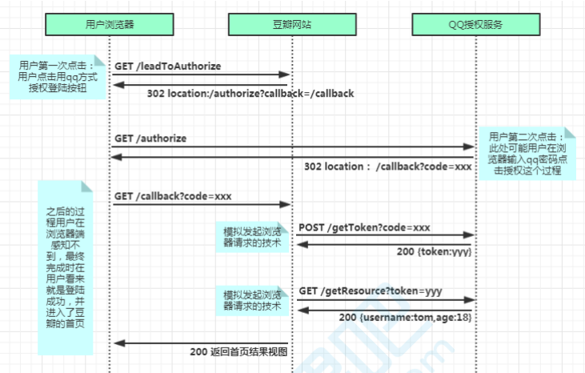

## 第三方鉴权图片



## 配置 GitHub 参数

> 配置之后，可以通过 `this.ctx.app.config.github` 获取到数据

```typescript
config.github = {
  // 固定的
  login_url: 'https://github.com/login/oauth/authorize',
  // github Client ID
  client_id: 'xxxxxxxxxxxxxx',
  // github Client Secret
  client_secret: 'xxxxxxxxxxxxx',
  // 此参数表示只获取用户信息
  scope: ['user'],
}
```

## Query

```typescript
type Query {
  githubURL: String!
}
```

## resolve

```typescript
export default {
  Query: {
    async githubURL(_root: any, {}, { connector }) {
      return await connector.utils.githubURL()
    },
  },
}
```

## connector

```typescript
import { Context } from 'egg'

export default class UtilsConnector {
  ctx: Context
  constructor(ctx: Context) {
    this.ctx = ctx
  }
  /**
   * 获取GitHub 登录地址
   */
  public githubURL() {
    const { login_url, client_id, scope } = this.ctx.app.config.github
    return `${login_url}?client_id=${client_id}&scope=${scope}&state=${Date.now()}`
  }
}
```

## 回调路由

```typescript
import { Application } from 'egg'

export default (app: Application) => {
  const { controller, router } = app
  // github 回调
  router.get('/github/callback', controller.user.githubLogin)
}
```

## 控制器

```typescript
// controller/user.ts

import { Controller } from 'egg'

export default class UserController extends Controller {
  /**
   * GitHub 登录
   */
  async githubLogin() {
    const { ctx, app } = this
    const { client_id, client_secret } = app.config.github
    try {
      // 验证 code
      const code = ctx.query.code
      const tokenResult = await ctx.curl(
        'https://github.com/login/oauth/access_token',
        {
          method: 'POST',
          contentType: 'json',
          data: {
            client_id,
            client_secret,
            code,
          },
          dataType: 'json',
          timeout: 16000,
        }
      )
      if (tokenResult.data.error || tokenResult.status !== 200) {
        return await this.ctx.render('transit.html', {
          uuid: tokenResult.data.error,
        })
      }
      const { access_token } = tokenResult.data
      // 根据 token 获取用户信息
      const userResult = await ctx.curl(
        `https://api.github.com/user?access_token=${access_token}`,
        {
          dataType: 'json',
          timeout: 16000,
        }
      )
      if (userResult.data.error || userResult.status !== 200) {
        return await this.ctx.render('transit.html', {
          uuid: userResult.data.error,
        })
      }
      const { login, node_id } = userResult.data
      if (!login || !node_id) {
        return await this.ctx.render('transit.html', {
          uuid: '权限验证失败, 请重试',
        })
      }
      const uuid = ctx.helper.uuidv1()
      const oauth = await ctx.service.oauth.findById(node_id)
      if (!oauth) {
        userResult.data.oauth_type = 'GitHub'
        const user = await ctx.service.user.githubRegister(userResult.data)
        const userInfo = JSON.stringify(user)
        await ctx.service.redis.set(uuid, userInfo, 3600 * 24)
      } else await ctx.service.redis.set(uuid, oauth, 3600 * 24)
      await this.ctx.render('transit.html', { uuid })
    } catch (err) {
      if (err.toString().indexOf('timeout') > -1) {
        return await this.ctx.render('transit.html', {
          uuid: '接口请求超时,请重试！',
        })
      }
      return await this.ctx.render('transit.html', { uuid: err })
    }
  }
}
```

!> 常用的帮助函数在 `extend/helper.ts`中， 例如 `ctx.helper.uuidv1()`

## 窗口间通信 postMessage

```html
<!-- transit.html -->
<!DOCTYPE html>
<html lang="en">
  <head>
    <meta charset="UTF-8" />
    <meta name="viewport" content="width=device-width, initial-scale=1.0" />
    <meta http-equiv="X-UA-Compatible" content="ie=edge" />
    <title>Document</title>
  </head>
  <body>
    登陆中...
    <script>
      window.onload = function () {
        // 这里的 link 就等于是你前端应用接收信息的页面
        const link = 'https://www.baidu.com/'
        window.opener.postMessage('<%= uuid %>', link)
        window.close()
      }
    </script>
  </body>
</html>
```

window.open 方法会返回一个窗口对象，使用这个对象可以向子窗口发送消息，而子窗口可以通过 window.opener 向父窗口发送消息

子窗口通过 `window.addEventListener("message",function (e){})` 接收参数

## 参考

此文是根据 [基于 NodeJS 构建 GraphQL API 服务](https://juejin.im/book/5e588e04518825492b50b274/section/5e588f54518825494c75e934) 总结
