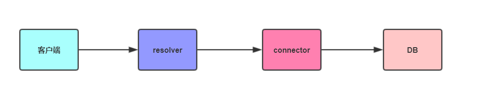

## 什么是 graphql

`GraphQL` 支持声明式数据获取，客户端可以在其中准确地指定需要从 API 获取哪些数据。与返回固定数据结构的多个端点（`multiple endpoints`）不同，`GraphQL` 服务器只公开单个端点（`a single endpoint`），并使用客户机请求的准确数据进行响应。

## GraphQL vs REST

| REST                           | GraphQL                    |
| ------------------------------ | -------------------------- |
| 接口灵活性差，接口操作流程繁琐 | 声明式的数据获取           |
| 客户端扩展功能时要不断写新接口 | 一个服务仅暴露一个 graphql |
| 基于 HTTP 协议                 | 传输层无关，数据库技术无关 |

## GraphQL 各个参数解读

- schema.graphql

> 定义数据格式，类型

graphql 自带一组默认标量类型，包括 `Int`，`Float`，`String`，`Boolean`，`ID`。在定义字段时需要注明类型，这也是 graphql 的特点之一，是支持强类型的。如果非空，就在类型后面跟上一个!号。graphql 还包括枚举类型，列表和自定义类型。

```typescript
type Person {
  id: ID!
  name: String!
}
//  任何对于此枚举的数据交换，都会自动将枚举值替换为枚举名，避免了枚举值泄露到客户端的问题
const BookStatus = {
  DELETE: 0,
  NORMAL: 1,
}
```

- connector

> connector 的职责就是 “取数”， 既可以调用 rpc 接口取数，又可以调用内置的 orm 插件去取数，还可以直接调用 egg 的 service。

```typescript
export default class HelloConnector {
  hellos() {
    return [
      {
        id: 1,
        name: 'Jack',
      },
      {
        id: 2,
        name: 'Lucy',
      },
    ]
  }
}
```

- resolver

> 对你暴露的查询接口，调用相应的 connector 去取数即可

```typescript
export default {
  Query: {
    hellos(_root: any, {}, { connector }) {
      return connector.hello.hellos()
    },
  },
}
```

- Query

> 新建一个 query 目录创建 schema.graphql 文件，规定 resolver 函数

```typescript
type Query {
  hellos: [Hello!]
}
```

## 请求流程



通过上方的例子我们可以看出客户端发送请求会被 `graphql` 解析，根据`schema.graphql`中的`Query`映射关系找到对应的 `resolver`。路由将数据传递到对应的 `resolver`，`resolver` 去调用对应的 `connector` 进行处理，`connector` 再调用 `service` 进行数据库处理。
