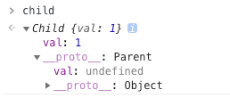
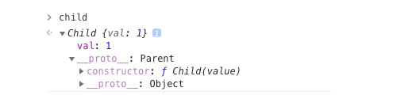

> 涉及面试题：原型如何实现继承？`Class` 如何实现继承？`Class` 本质是什么？

!> `class`在 `JS`中并不存在类，`class` 只是语法糖，本质还是函数

```javascript
class Person {}
Person instanceof Function // true
```

## 组合继承

- 组合继承是最常用的继承方式

```javascript
function Parent(value) {
  this.val = value
}
Parent.prototype.getValue = function() {
  console.log(this.val)
}
function Child(value) {
  Parent.call(this, value)
}
Child.prototype = new Parent()

const child = new Child(1)

child.getValue() // 1
child instanceof Parent // true
```

- 以上继承的方式核心是在子类的构造函数中通过 `Parent.call(this)` 继承父类的属性，然后改变子类的原型为 `new Parent()` 来继承父类的函数。
- 这种继承方式优点在于构造函数可以传参，不会与父类引用属性共享，可以复用父类的函数，但是也存在一个缺点就是在继承父类函数的时候调用了父类构造函数，导致子类的原型上多了不需要的父类属性，存在内存上的浪费



## 寄生组合继承

- 解决了子类原型上面会有父类的属性

```javascript
function Parent(value) {
  this.val = value
}
Parent.prototype.getValue = function() {
  console.log(this.val)
}

function Child(value) {
  Parent.call(this, value)
}
Child.prototype = Object.create(Parent.prototype, {
  constructor: {
    value: Child,
    enumerable: false,
    writable: true,
    configurable: true
  }
})

const child = new Child(1)

child.getValue() // 1
child instanceof Parent // true
```

- 以上继承实现的核心就是将父类的原型赋值给了子类，并且将构造函数设置为子类，这样既解决了无用的父类属性问题，还能正确的找到子类的构造函数。



## Class 继承

- 以上两种继承方式都是通过原型去解决的，在 ES6 中，我们可以使用 class 去实现继承，并且实现起来很简单

```javascript
class Parent {
  constructor(value) {
    this.val = value
  }
  getValue() {
    console.log(this.val)
  }
}
class Child extends Parent {
  constructor(value) {
    super(value)
    this.val = value
  }
}
let child = new Child(1)
child.getValue() // 1
child instanceof Parent // true
```

> `class` 实现继承的核心在于使用 `extends` 表明继承自哪个父类，并且在子类构造函数中必须调用 `super`，因为这段代码可以看成 `Parent.call(this, value)`。
