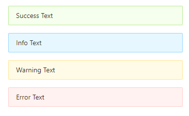
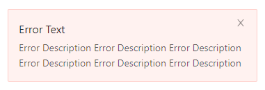

## 需求

##### 原型图

1. 普通 alert，⽀持多种主题颜⾊



2. 特殊 alert，可以添加描述



功能点要求：

1.  点击 关闭 整个元素消失
2.  ⽀持四种主题颜⾊

```typescript
export type AlertType = 'success' | 'default' | 'danger' | 'warning'
```

3.  可以包含标题和内容，解释更详细的警告
4.  右侧是否显⽰关闭按钮可配置

## 代码实现

```typescript
// Alert/alert.tsx
import React, { useState } from 'react'
import classNames from 'classnames'
export type AlertType = 'success' | 'info' | 'danger' | 'warning'

export interface AlertProps {
  className?: string
  discription?: string | React.ReactNode
  title: string // title 是必传参数
  type?: AlertType
  closable?: boolean
}

const Alert: React.FC<AlertProps> = (props) => {
  const [isClose, setClose] = useState(false)
  const { className, discription, title, closable, type } = props
  // 根据不同的类型添加不同的类型
  const classes = classNames('alert', className, {
    [`alert-${type}`]: type,
  })
  if (isClose) {
    return null
  }
  return (
    <div className={classes}>
      <div className="alert-message">{title}</div>
      <div className="alert-description">{discription}</div>
      {closable && (
        <button className="alert-close" onClick={() => setClose(true)}>
          <svg
            width="10"
            height="10"
            version="1.1"
            xmlns="http://www.w3.org/2000/svg"
          >
            <polyline
              points="0,0 10,10"
              style={{
                fill: 'white',
                stroke: 'rgba(0,0,0,.45)',
                strokeWidth: 1,
              }}
            />
            <polyline
              points="10,0 0,10"
              style={{
                fill: 'white',
                stroke: 'rgba(0,0,0,.45)',
                strokeWidth: 1,
              }}
            />
          </svg>
        </button>
      )}
    </div>
  )
}
Alert.defaultProps = {
  closable: false,
  type: 'info',
}
export default Alert
```

```scss
//_variables.scss
//alert
$alert-padding-x: 0.75rem !default;
$alert-padding-y: 0.375rem !default;
// Alert/_style.scss
.alert {
  font-size: $font-size-lg;
  padding: $alert-padding-y $alert-padding-x;
  border: $btn-border-width solid transparent;
  margin: 0 0.5rem;
  line-height: $line-height-lg;
  position: relative;

  .alert-description {
    line-height: $line-height-sm;
    font-size: $font-size-base;
  }

  .alert-close {
    outline: none;
    background-color: transparent;
    border: 0;
    position: absolute;
    right: $alert-padding-x;
    top: $alert-padding-y;
    line-height: $line-height-base;
  }
}

.alert-danger {
  @include background-color($danger, $black);
}

.alert-info {
  @include background-color($info, $black);
}

.alert-success {
  @include background-color($success, $black);
}

.alert-warning {
  @include background-color($warning, $black);
}
```
