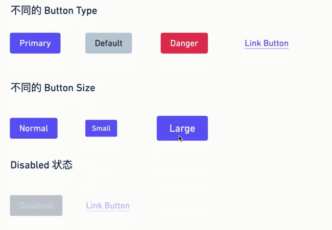

## 需求分析



## button 组件

```typescript
import React from 'react'
import classNames from 'classnames'
export type ButtonSize = 'large' | 'small'
export type ButtonType = 'primary' | 'default' | 'danger' | 'link'

interface ButtonProps {
  className?: string
  disabled?: boolean
  size?: ButtonSize
  btnType?: ButtonType
  children?: React.ReactNode
  href?: string
}

const Button: React.FC<ButtonProps> = (props) => {
  const { disabled, size, btnType, children, href } = props

  const classes = classNames('btn', {
    [`btn-${btnType}`]: btnType,
    [`btn-${size}`]: size,
    disabled: btnType === 'link' && disabled,
  })
  // 如果是 link 则返回 a 标签，否则返回button
  if (btnType === 'link') {
    return (
      <a href={href} className={classes}>
        {children}
      </a>
    )
  } else {
    return (
      <button className={classes} disabled={disabled}>
        {children}
      </button>
    )
  }
}
Button.defaultProps = {
  btnType: 'default',
  disabled: false,
}
export default Button
```

## 样式添加

1. 添加 button 基础样式

```scss
// Button/_style.scss
.btn {
  // 设置 btn 的默认样式
  position: relative;
  display: inline-block;
  font-weight: $btn-font-weight;
  line-height: $btn-line-height;
  color: $body-color;
  white-space: nowrap;
  text-align: center;
  vertical-align: middle;
  background-image: none;
  border: $btn-border-width solid transparent;
  @include button-size(
    $btn-padding-y,
    $btn-padding-x,
    $btn-font-size,
    $border-radius
  );
  box-shadow: $btn-box-shadow;
  cursor: pointer;
  transition: $btn-transition;
  &.disabled,
  &[disabled] {
    cursor: not-allowed;
    opacity: $btn-disabled-opacity;
    box-shadow: none;
    > * {
      pointer-events: none; //去除子元素的点击事件
    }
  }
}
```

上面有 `button-size` 的 mixin, 我们设置两个 mixin 函数

```scss
// _mixin.scss
@mixin button-size($padding-y, $padding-x, $font-size, $border-raduis) {
  padding: $padding-y $padding-x;
  font-size: $font-size;
  border-radius: $border-raduis;
}

@mixin button-style(
  $background,
  $border,
  $color,
  $hover-background: lighten($background, 7.5%),
  $hover-border: lighten($border, 10%),
  $hover-color: $color
) {
  color: $color;
  background: $background;
  border-color: $border;

  &:hover {
    color: $hover-color;
    background: $hover-background;
    border-color: $hover-border;
  }

  &:focus,
  &.focus {
    color: $hover-color;
    background: $hover-background;
    border-color: $hover-border;
  }

  &:disabled,
  &.disabled {
    color: $color;
    background: $background;
    border-color: $border;
  }
}
```

## 其他样式

```scss
// Button/_style.scss
.btn-large {
  @include button-size(
    $btn-padding-y-lg,
    $btn-padding-x-lg,
    $btn-font-size-lg,
    $btn-border-radius-lg
  );
}

.btn-small {
  @include button-size(
    $btn-padding-y-sm,
    $btn-padding-x-sm,
    $btn-font-size-sm,
    $btn-border-radius-sm
  );
}

.btn-primary {
  @include button-style($primary, $primary, $white);
}

.btn-danger {
  @include button-style($danger, $danger, $white);
}

.btn-default {
  @include button-style(
    $white,
    $gray-400,
    $body-color,
    $white,
    $primary,
    $primary
  );
}

.btn-link {
  font-weight: $font-weight-normal;
  color: $btn-link-color;
  text-decoration: $link-decoration;
  box-shadow: none;

  &:hover {
    color: $btn-link-hover-color;
    text-decoration: $link-hover-decoration;
  }

  &:focus,
  &.focus {
    text-decoration: $link-hover-decoration;
    box-shadow: none;
  }

  &:disabled,
  &.disabled {
    color: $btn-link-disabled-color;
    pointer-events: none;
  }
}
```

## 完美收官

现在的组件只可以添加已经添加的属性，不能添加`onClick`等事件，react 已经原生提供这样的属性，button 的的属性为 `ButtonHTMLAttributes<HTMLElement>`, `a` 标签的属性为 `AnchorHTMLAttributes<HTMLElement>`,所以需要修改代码

```typescript
type NativeButtonProps = BaseButtonProps & ButtonHTMLAttributes<HTMLElement>
type AnchorButtonProps = BaseButtonProps & AnchorHTMLAttributes<HTMLElement>
// 变为可选属性
export type ButtonProps = Partial<NativeButtonProps & AnchorButtonProps>
```

## 添加测试

```typescript
// Button/button.test.tsx
import React from 'react'
import { render, fireEvent } from '@testing-library/react'
import Button, { ButtonProps } from './button'

const defaultProps: ButtonProps = {
  onClick: jest.fn(),
}

const testProps: ButtonProps = {
  btnType: 'primary',
  size: 'large',
  className: 'sunsmile',
}

const disabledProps: ButtonProps = {
  disabled: true,
  onClick: jest.fn(),
}
describe('test BUTTON component', () => {
  it('should render the correct default button', () => {
    const wrapper = render(<Button {...defaultProps}>Nice</Button>)
    const element = wrapper.getByText('Nice') as HTMLButtonElement
    expect(element).toBeInTheDocument()
    expect(element.tagName).toEqual('BUTTON')
    expect(element).toHaveClass('btn btn-default')
    expect(element.disabled).toBeFalsy()
    fireEvent.click(element)
    expect(defaultProps.onClick).toHaveBeenCalled()
  })

  it('should render the correct component based on different props', () => {
    const wrapper = render(<Button {...testProps}>Nice</Button>)
    const element = wrapper.getByText('Nice') as HTMLButtonElement
    expect(element).toBeInTheDocument()
    expect(element).toHaveClass('btn btn-primary btn-large sunsmile')
  })
  it('should render a link when btnType equals link and href is provided', () => {
    const wrapper = render(
      <Button btnType="link" href="http://www.baidu.com">
        Link
      </Button>
    )
    const element = wrapper.getByText('Link')
    expect(element).toBeInTheDocument()
    expect(element.tagName).toEqual('A')
    expect(element).toHaveClass('btn btn-link')
  })
  it('should render disabled button when disabled set to true', () => {
    const wrapper = render(<Button {...disabledProps}>Disabled</Button>)
    const element = wrapper.getByText('Disabled') as HTMLButtonElement
    expect(element).toBeInTheDocument()
    expect(element.disabled).toBeTruthy()
    fireEvent.click(element)
    expect(disabledProps.onClick).not.toHaveBeenCalled()
  })
})
```
