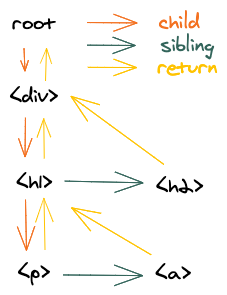
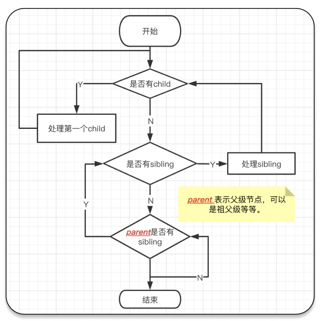

# 动手实现 React (三)

> 文章基于React 16.8

我们将从头开始一步一步重写React。遵循真实的React代码中的架构，但`没有所有的优化和非必要的功能`。

> 目录

1. [`createElement`](/react/sunsmile-react1#_1createelement)
2. [`render`](/react/sunsmile-react1#_2render)
3. [`Concurrent Mode`](/react/sunsmile-react2)
4. [`Fibers`](/react/sunsmile-react3?id=fibers)
5. [`Render 和 Commit 阶段`](/react/sunsmile-react3?id=render-和-commit-阶段)
6. Reconciliation
7. Function Components
8. Hooks

## Fibers

通过上一篇文章，我们了解到我们需要把下一个需要处理的单元存储在`nextUnitOfWork`中，在浏览器空闲的时候再继续处理，我想你心里一定有一个问题，怎么知道下一个处理的单元呢？

我们来看看它的数据结构
```javascript
const newFiber = {
    type: element.type,  // 存储 string->表签名｜function
    props: element.props, // 存储属性
    parent: fiber, // 指向父节点 源码中为 return 属性
    sibling: fiber, // 指向兄弟节点
    child: fiber, // 指向孩子节点
    dom: null, // 存储 dom 元素
}
```
> 通过上面你一定发现，笔者发现`fiber`在`Concurrent Mode`模块下，主要有以下作用：1. 存储中间状态；2.指向明确【`parent`/`sibling`/`child`】

接下来，通过举例子的方式来让你加深对`fiber`的理解
```javascript
SunsmileReact.render(
  <div>
    <h1>
      <p />
      <a />
    </h1>
    <h2 />
  </div>,
  container
)
```

<div align=center></div>

通过图片，是不是有一种豁然开朗的感觉？把`JSX`转换为`fiber树`。我们都知道`Concurrent Mode`是把我们第一讲中的不可中断的递归变为`异步可中断`方式去处理每一个节点。那你肯定有一个疑问，如果同时有`child`、`sibling`怎么处理呢？

二话不说直接上图:

<div align=center></div>

> 实现

1. 在`render`函数中，我们将`nextUnitOfWork`设置`Fiber`根节点 *【容器节点】*
```javascript
function render(element, container) {
	nextUnitOfWork = {
		dom: container,
		props: {
			children: [element],
		},
	}
}
```
2. 在`performUnitOfWork`中需要实现以下功能：
 - 创建`dom`节点，并添加到`dom`树中
 - 为`children`创建新的`Fiber`
 - 选择下一个`Fiber`节点
```javascript
// 创建dom节点
function createDom(fiber) {
		const dom =
			fiber.type == "TEXT_ELEMENT"
				? document.createTextNode("")
				: document.createElement(fiber.type)
	​
		const isProperty = key => key !== "children"
		Object.keys(fiber.props)
			.filter(isProperty)
			.forEach(name => {
				dom[name] = fiber.props[name]
			})
		​
		return dom
}
function performUnitOfWork(fiber) {
		// 创建 dom 节点
		if (!fiber.dom) {
			fiber.dom = createDom(fiber)
		}
	​	 //添加到父级节点
		if (fiber.parent) {
			fiber.parent.dom.appendChild(fiber.dom)
		}

		// 为孩子创建新的fiber节点 并添加到fiber树中
		const elements = fiber.props.children
		let index = 0
		let prevSibling = null

		while (index < elements.length) {
			const element = elements[index]
	​		 // 创建 fiber 节点
			const newFiber = {
				type: element.type,
				props: element.props,
				parent: fiber,
				dom: null,
			}
			// 添加到 fiber 树
			if (index === 0) {
				fiber.child = newFiber
			} else {
				prevSibling.sibling = newFiber
			}

			prevSibling = newFiber
			index++
		}

		// 选择下一个节点
		if (fiber.child) {
			return fiber.child
		}
		let nextFiber = fiber
		while (nextFiber) {
			if (nextFiber.sibling) {
				return nextFiber.sibling
			}
			nextFiber = nextFiber.parent
		}
}
```
> 阶段代码：https://github.com/sunsmile-ls/sunsmileReact/tree/0.0.3

### Render 和 Commit 阶段

我们在之前的`Concurrent Mode`中知道浏览器会打断我们代码的执行，再根据上面的代码，你一定会发现有问题`在完成渲染整个树之前，浏览器可能会中断我们的工作。 在这种情况下，用户将看到不完整的UI。`

 不卖关子，直接上解决方案。`React`会把构造`fiber树`和渲染分开 -- `Render 和 Commit 阶段`。

 在`render 阶段`只创建了`fiber树`，在`commit 阶段`根据已经创建的`fiber 树` 渲染到页面上面。我想你心里一定在想，怎么分开呢？`要遍历两次`。

1. 我们需要移除`performUnitOfWork`函数中的以下代码：

```javascript
if (fiber.parent) {
	fiber.parent.dom.appendChild(fiber.dom)
}
```
 2. 因为要遍历两次，所以我们需要记住根`fiber`节点

 ```javascript
 let wipRoot = null
 function render(element, container) {
	wipRoot = {
		dom: container,
		props: {
		children: [element],
		},
	}
	nextUnitOfWork = wipRoot
}
 ```
3. 在完成fiber树的创建之后我们执行`commit阶段`

```javascript
function workLoop(deadline) {
​	...
	// 表示没有下一个处理单元，并且有根节点
	if (!nextUnitOfWork && wipRoot) {
    	commitRoot()
   	}
   	requestIdleCallback(workLoop)
}
```

4. 最后我们来揭示以下`commit`的真面目吧

```javascript
function commitRoot() {
  commitWork(wipRoot.child)
  wipRoot = null
}
​
function commitWork(fiber) {
  if (!fiber) {
    return
  }
  // 添加 dom 到页面中
  const domParent = fiber.parent.dom
  domParent.appendChild(fiber.dom)
  commitWork(fiber.child)
  commitWork(fiber.sibling)
}
```
至此，我们`Render 和 Commit 阶段`已经完成。

> 源码请看 https://github.com/sunsmile-ls/sunsmileReact/tree/0.0.4

未完待续...... 防止走失，请关注作者。


