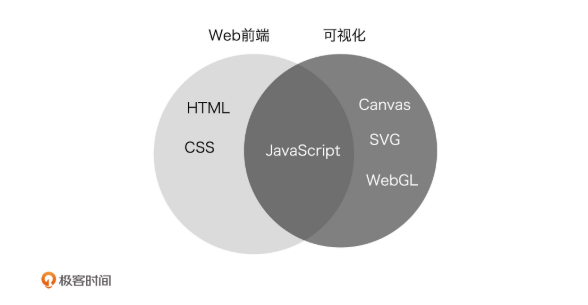
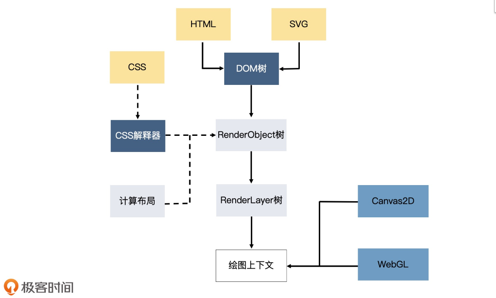
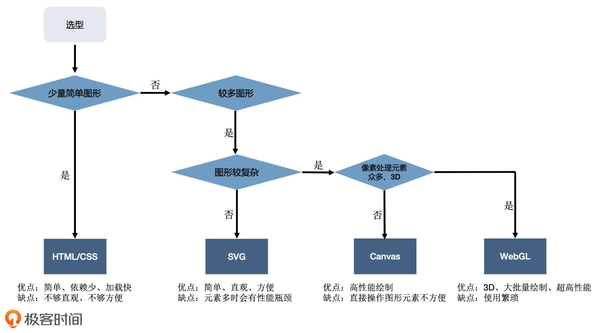

!> 根据 [跟月影学可视化](https://time.geekbang.org/column/article/252088) 总结而来。如果深入学习，建议自行购买

## 前端工程师为什么要学可视化？

- 现在很多 `C` 端或者 `B` 端的互联网产品都离不开可视化。

  - C 端: 淘宝“双十一”购物节的可视化大屏
  - B 端：智慧城市、智慧社区、智慧生活等等

- 可视化能实现很多传统 Web 网页无法实现的效果

  - 在大屏上用浏览器渲染数以万计的元素时，也许 WebGL 或者 GPU 就是目前唯一可行的方案

> 可视化的视觉主要涉及四个部分，分别是`理论基础`、`图形系统`、`图形库`和`工具`。 视觉部分的理论基础就是`数学`和`图形学`

## 可视化的定义

可视化是将数据组织成易于为人所理解和认知的结构，然后用图形的方式形象地呈现出来的理论、方法和技术。实现可视化有三个关键要素：`数据`、`图形`、`交互`

## Web 前端与可视化有什么区别

1. 技术栈的不同

2. Web 开发着重于`处理普通的文本和多媒体信息`，渲染`普通的、易于阅读的文本和多媒体内容`，而可视化开发则着重于`处理结构化数据`，渲染`各种相对复杂的图表和图形元素`。
> Web 开发的前端主要还是关注`内容和样式`，`图形的渲染和绘制是由浏览器底层来完成`的，而可视化前端则可能要`深入底层渲染层`，去真正地`控制图形的绘制和细节的呈现`

## 前端为什么可以学习可视化

- 可视化与 Web 前端一样，最终都`是以图像呈现在浏览器上`，因此有许多通用的方法论

- 二者`都使用 JavaScript`，而且都是浏览器端的 JavaScript

- 可视化领域也有丰富的 JavaScript 工具和活跃的生态

## 可视化领域的工具分类

- 图表库 [`ECharts、chartlist、chart.js`]

- 地理库 [`Mapbox、Leaflet、Deck.gl、CesiumJS`]

- 渲染库 [`ThreesJS、SpriteJS`] 绘制其他更灵活的图形、图像或者物理模型

- 数据驱动框架 [`D3.js`]

> `D3.js` 专注于处理数据的组织形式，而将数据呈现交给更底层的图形系统（DOM、SVG、Canvas）或通用图形库（SpriteJS、ThreeJS）去完成

## 浏览器中实现可视化的四种方式

- HTML+CSS

  - 优点
    - 既能简化开发，又不需要引入额外的库，`可以节省资源，提高网页打开的速度` 
  - 缺点
    - 难看出数据与图形的对应关系，有很多换算也需要开发人员自己来做。`一旦图表或数据发生改动，就需要我们重新计算，维护起来会很麻烦`。
    - HTML 和 CSS 作为浏览器渲染引擎的一部分，为了完成页面渲染的工作，除了`绘制图形外，还要做很多额外的工作`。比如说，`浏览器的渲染引擎在工作时，要先解析 HTML、SVG、CSS，构建 DOM 树、RenderObject 树和 RenderLayer 树，然后用 HTML（或 SVG）绘图`
  
  

- svg
  - 优点
    - 弥补了 `HTML` 绘制不规则图形的能力
  - 缺点
    -  HTML 和 CSS 作为浏览器渲染引擎的一部分，为了完成页面渲染的工作，除了`绘制图形外，还要做很多额外的工作`。比如说，`浏览器的渲染引擎在工作时，要先解析 HTML、SVG、CSS，构建 DOM 树、RenderObject 树和 RenderLayer 树，然后用 HTML（或 SVG）绘图`
    -  图形复杂时需要的 SVG 元素太多，也非常消耗性能

- Canvas2D
  - 优点
    - `Canvas2D` 直接操作绘图上下文，性能要比前两者快得多
  - 缺点
    - 要绘制的图形太多，或者处理大量的像素计算时，Canvas2D 依然会遇到性能瓶颈

- WebGL [`功能强大的绘图系统`]
  - 优点 
    - 能够`充分利用 GPU 并行计算的能力`，来`快速、精准地操作图像的像素`，在`同一时间完成数十万或数百万次计算`。另外，它还内置了对 `3D 物体的投影`、`深度检测等处理`，这让它更适合绘制 3D 场景
  - 缺点
    - 使用比较复杂

## 总结

