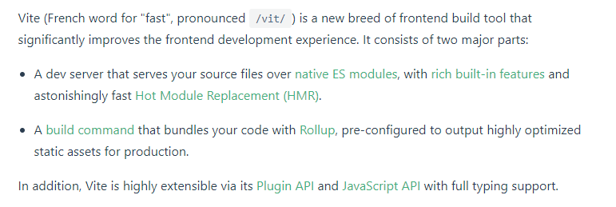

> 本文档的宗旨是制造一本严谨、易懂的 `vite`源码解析读物。

为了保证文章更加贴合实际，本文档遵循：

1. 不参杂个人观点 -- 所有观点都来源于源码、官方文档
2. 持续更新 -- 本文档目前的版本是 `2.0.0-beta.27`

## 整体介绍

> 根据官方文档介绍：

vite 是一个极速提高前端开发体验的打包工具。主要包括几方面：

1. 使用`浏览器原生支持的es module`，并具有`丰富的内置功能`和`惊人的快速热模块替换`

2. 在生产环境，根据预先配置，使用 `rollup` 打包出高度优化的代码 

3. 具有`高度的可扩展性`

## vite 的优势

1. 利用浏览器的文件的请求，实现`按需加载`,避免全部
   
2. `缓存文件`；更新仅需要精确地重新获取失效的模块

> Once you experience how fast Vite is, we highly doubt you'd be willing to put up with bundled development again.

## 章节目录

**第一章 导学篇**

- [ ] ES module 介绍
- [ ] 常用模块介绍
- [ ] 源码调试

**第二章 架构篇**

 - [ ] yarn create @vitejs/app 的背后实现
 - [ ] vite (上)
 - [ ] vite (下)
 - [ ] vite build
 - [ ] vite optimize
 - [ ] 深入 HRM
 - [ ] 深入 plugin
  
**第三章 实战篇**

 - [ ] 插件开发
 - [ ] 实现小型的 vite (上)
 - [ ] 实现小型的 vite (下)