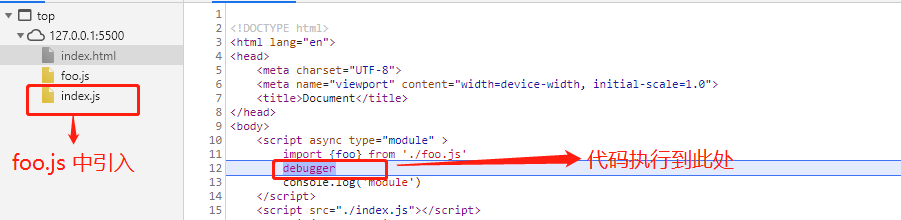

### ES6 module

> 官方：Vite requires [native ESM dynamic import support](https://caniuse.com/es6-module-dynamic-import) during development.

`vite` 在开发环境使用的是原生的 esm module。 那么，各大浏览器从何时开始支持module的：

* Safari 10.1.
* Chrome 61.
* Firefox 60.
* Edge 16.

从上面可以看到主流的浏览器已经支持 ESM module 了，我们来看看 ESM module 需要注意的地方

```html
<script type="module">
    import { foo } from './foo.js'
    foo();
</script>
<script nomodule>
    console.log("native ESM dynamic import is't support")
</script>
```
```javascript
// foo.js
export const foo = ()=>{
     console.log('this is ESM module');
}
```
从上面的代码我们可以发现，在script中添加 `type='module'` 表示启用 `ESM module`。浏览器支持，会忽略`nomodule`; 如果不支持，会执行 `nomodule` 的逻辑，而忽略`ESM module`。

> 因为浏览器默认只解析`type="text/javascript"`的脚本，而如果不填写type属性则默认为`text/javascript`。也就是说在浏览器不支持module的情况下，nomodule对应的脚本文件就会被执行。

#### 你不知道的 ESM

1. 你真的了解`from`吗？
   
```javascript
// 支持
import module from 'http://XXX/module.js'
import module from '/XXX/module.js'
import module from './XXX/module.js'
import module from '../XXX/module.js'

// 不支持
import vue from 'vue'
import vue from 'vue/dist/ems.js'
```
当我们看到这儿可能会有疑问，为什么 `import vue from 'vue'` 不行，`webpack`？ 在webpack打包的文件中，引用全局包是通过 `import vue from 'vue' ` 来实现的。
实际上，webpack会根据这个路径去 `node_modules` 中找到对应的 `module` 并引入进来。`from`后边的路径一定要是一个有效的URL，以及一定不能省略文件后缀。

2. `module` 的文件默认为 `defer`

[`w3cSchool中的解释`](https://www.w3school.com.cn/tags/att_script_defer.asp) `defer` 属性规定是否对脚本执行进行延迟，直到页面加载为止。

可以理解为：`defer` 将文件标识为不会阻塞页面渲染的文件，并且会在页面加载完成后按照文档的顺序进行执行。

```html
<script type="module" src="./module.js"></script>
<script src="./sync.js"></script>
```
上面`module.js`和`sync.js` 会开启异步加载，`module.js`会等到`sync.js`执行完成才会执行。

`defer` 默认对脚本文件生效，`inline-script`，不生效的。`type="module"` 不管是文件还是行内脚本，都会具有`defer`的特性。

3. `type='module'`标签上使用 `async`

```html
<script async type="module" >
    import {foo} from './foo.js'
    console.log('module')
</script>
<script src="./index.js"></script>
```
[`w3cSchool中的解释`](https://www.w3school.com.cn/tags/att_script_async.asp)：`async` 属性规定一旦脚本可用，则会异步执行。



可以看出，添加了 `async` 关键字以后并不意味着浏览器在解析到这个脚本文件时就会执行，而是在这段脚本所依赖的所有module加载完毕后再执行。

4. 一个module只会加载一次

如果当前页面路径为 `https://www.sunsmile.com/a/b/c.html`，则文件中的`/module.js`、`../../module.js`与`https://www.sunsmile.com/module.js`都会被认为是同一个`module`。

`module1.js`与`module1.js?a=1`就被认定为`两个 module`