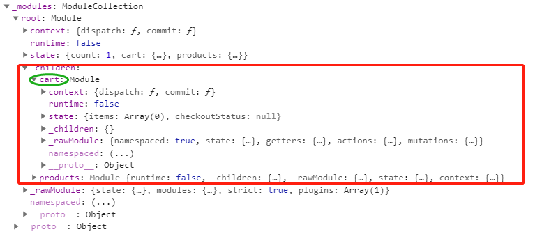

## vuex

!> 本教程是根据 [vuex-4.0.0-beta.1](https://github.com/vuejs/vuex/tree/v4.0.0-beta.1)解读，并且会长期维护

> 我分析的方法是明确入口，分析出口，然后确认出口的方法

`vuex`借鉴了 `Flux`、`Redux` 。`Vuex` 是专门为 `Vue.js` 设计的状态管理库。

## 为什么要用 vuex?

- 多个视图依赖于同一状态。**[多层嵌套状态传递繁琐、兄弟组件状态无能为力]**
- 来自不同视图的行为需要变更同一状态。**[通过事件，props 传递状态会导致代码难以维护]**
- `Vuex` 也集成到 `Vue` 的官方调试工具 `devtools extension`，提供了诸如零配置的 `time-travel` 调试、状态快照导入导出等高级调试功能

## vuex 架构图


## vuex 的基本使用

`vuex` 为了和 `Vue 3` 初始化过程保持一致，Vuex 的安装过程也已更改。

```javascript
// store.js
import { createStore } from 'vuex'

const debug = process.env.NODE_ENV !== 'production'

export default createStore({
  state: {
    count: 1
  },
  modules: {
    cart,
    products
  },
  strict: debug,
  plugins: debug ? [createLogger()] : []
})
```

```javascript
// main.js
import { createApp } from 'vue'
import store from './store'
import App from './APP.vue'

const app = createApp(App)

app.use(store)

app.mount('#app')
```

## 源码部分

因为创建 `store` 是通过调用 `createStore api` 创建的，返回一份 `Store` 的实例, 接下来我们来分析一下 `Store` 的构造函数

```javascript
constructor (options = {}) {
    const {
      //  应用在 store 中的插件，接收store本身
      plugins = [],
      // 是否开启严格模式，如果为 true 的话，只能在 mutation 中修改 store，外部修改会报错
      strict = false
    } = options

    // store internal state
    // 判断是不是在 mutation 中修改的 state，在 mutation 中修改会先把它改为 true
    this._committing = false
    // 存放 action
    this._actions = Object.create(null)
    this._actionSubscribers = []
    // 存放 mutation
    this._mutations = Object.create(null)
    // 存放 getter
    this._wrappedGetters = Object.create(null)
    // 收集 module [递归收集 子module 到_children 中]
    this._modules = new ModuleCollection(options)
    // 根据 nameSpace 存放 module
    this._modulesNamespaceMap = Object.create(null)
    // 存放订阅者
    this._subscribers = []
    this._makeLocalGettersCache = Object.create(null)

    // bind commit and dispatch to self
    const store = this
    const { dispatch, commit } = this
    // 绑定 dispatch 和 commit 中的 this 为 store
    this.dispatch = function boundDispatch (type, payload) {
      return dispatch.call(store, type, payload)
    }
    this.commit = function boundCommit (type, payload, options) {
      return commit.call(store, type, payload, options)
    }

    // strict mode
    // 严格模式
    this.strict = strict

    const state = this._modules.root.state

    // init root module.
    // this also recursively registers all sub-modules
    // and collects all module getters inside this._wrappedGetters
    // 初始化根 module，递归的注册所有的子 moudle,收集所有的 getters 到 _wrappedGetters
    installModule(this, state, [], this._modules.root)

    // initialize the store state, which is responsible for the reactivity
    // (also registers _wrappedGetters as computed properties)
    // 初始化 store 的状态， 并且吧 _wrappedGetters 注册为计算属性
    resetStoreState(this, state)

    // 应用 plugin 到 store 上面
    plugins.forEach(plugin => plugin(this))

    // devTools 默认为开启状态
    const useDevtools = options.devtools !== undefined ? options.devtools : /* Vue.config.devtools */ true
    if (useDevtools) {
      devtoolPlugin(this)
    }
  }
```

接下来我们来分析一下 `ModuleCollection`入参是的例子的 `options`，子 `module` 会存放在`this.root._children`中，输出图为：


## 分析 installModule

上文提到了`installModule(this, state, [], this._modules.root)`，其含义为**初始化根 module，递归的注册所有的子 moudle,收集所有的 getters 到 \_wrappedGetters**。

```javascript
function installModule(store, rootState, path, module, hot) {
  // 如果 path 是 [] 则为根根 module
  const isRoot = !path.length
  // 获取命名空间
  const namespace = store._modules.getNamespace(path)

  // register in namespace map
  // 注册命名空间到 store._modulesNamespaceMap 中
  if (module.namespaced) {
    if (store._modulesNamespaceMap[namespace] && __DEV__) {
      console.error(
        `[vuex] duplicate namespace ${namespace} for the namespaced module ${path.join(
          '/'
        )}`
      )
    }
    store._modulesNamespaceMap[namespace] = module
  }

  // set state
  if (!isRoot && !hot) {
    // 根据上面的例子 path.slice(0, -1) 得到的为 [], 所以每次得到的都是 this._modules.root.state
    const parentState = getNestedState(rootState, path.slice(0, -1))
    const moduleName = path[path.length - 1]
    store._withCommit(() => {
      //
      parentState[moduleName] = module.state
    })
  }

  const local = (module.context = makeLocalContext(store, namespace, path))

  // 注册 mutation
  module.forEachMutation((mutation, key) => {
    const namespacedType = namespace + key
    registerMutation(store, namespacedType, mutation, local)
  })

  // 注册 action
  module.forEachAction((action, key) => {
    const type = action.root ? key : namespace + key
    const handler = action.handler || action
    registerAction(store, type, handler, local)
  })

  // 注册Getter
  module.forEachGetter((getter, key) => {
    const namespacedType = namespace + key
    registerGetter(store, namespacedType, getter, local)
  })

  // 递归注册 Module
  module.forEachChild((child, key) => {
    installModule(store, rootState, path.concat(key), child, hot)
  })
}
```

经过上面的代码，输出为下图


接下来看一下 `resetStoreState(this, state)`

```javascript
function resetStoreState(store, state, hot) {
  const oldState = store._state

  // bind store public getters
  // 绑定 store 到 getters 中
  store.getters = {}
  // reset local getters cache
  // 重置本地 getters 缓存
  store._makeLocalGettersCache = Object.create(null)
  const wrappedGetters = store._wrappedGetters
  const computedObj = {}
  // 通过 Object.defineProperty 的拦截 get， 并且通过 vue 的 computed 实现只有变化的时候才会返回新值
  forEachValue(wrappedGetters, (fn, key) => {
    // use computed to leverage its lazy-caching mechanism
    // direct inline function use will lead to closure preserving oldVm.
    // using partial to return function with only arguments preserved in closure environment.
    // 利用 computed 的懒惰的缓存机制，直接使用内联函数会导致闭包保留oldVm。
    computedObj[key] = partial(fn, store)
    Object.defineProperty(store.getters, key, {
      get: () => computed(() => computedObj[key]()).value,
      enumerable: true // for local getters
    })
  })

  // 利用 vue 的响应式处理 state
  store._state = reactive({
    data: state
  })

  // enable strict mode for new state
  // 如果为 strict 模式 ， 则开启 strict 为 state
  if (store.strict) {
    // 原理是利用了watch 的深层监听数据变化
    // 断言 store._committing， 如果为 false 则打印错误
    enableStrictMode(store)
  }

  if (oldState) {
    /* 解除旧state的引用，以及销毁旧的Vue对象 */
    if (hot) {
      // dispatch changes in all subscribed watchers
      // to force getter re-evaluation for hot reloading.
      store._withCommit(() => {
        oldState.data = null
      })
    }
  }
}
```

!> 通过 `this.$store.getters.cartProducts` 时机访问的是 `computedObj.cartProducts` 通过 computed 的值

## makeLocalContext

```js
/**
 * 如果没有命名空间，只需使用根空间，就可以进行本地化的调度、提交、getters和状态。
 * make localized dispatch, commit, getters and state
 * if there is no namespace, just use root ones
 */
function makeLocalContext(store, namespace, path) {
  const noNamespace = namespace === ''
  // 如果没有命名空间，则直接 dispatch
  const local = {
    dispatch: noNamespace
      ? store.dispatch
      : (_type, _payload, _options) => {
          const args = unifyObjectStyle(_type, _payload, _options)
          const { payload, options } = args
          let { type } = args
          // 否则就拼接 type 触发dispatch
          if (!options || !options.root) {
            type = namespace + type
            if (__DEV__ && !store._actions[type]) {
              console.error(
                `[vuex] unknown local action type: ${args.type}, global type: ${type}`
              )
              return
            }
          }

          return store.dispatch(type, payload)
        },

    commit: noNamespace
      ? store.commit
      : (_type, _payload, _options) => {
          const args = unifyObjectStyle(_type, _payload, _options)
          const { payload, options } = args
          let { type } = args

          if (!options || !options.root) {
            type = namespace + type
            if (__DEV__ && !store._mutations[type]) {
              console.error(
                `[vuex] unknown local mutation type: ${args.type}, global type: ${type}`
              )
              return
            }
          }

          store.commit(type, payload, options)
        }
  }

  // getters and state object must be gotten lazily
  // because they will be changed by state update
  Object.defineProperties(local, {
    getters: {
      get: noNamespace
        ? () => store.getters
        : () => makeLocalGetters(store, namespace)
    },
    state: {
      get: () => getNestedState(store.state, path)
    }
  })

  return local
}
```

## 严格模式

```javascript
function enableStrictMode(store) {
  watch(
    () => store._state.data,
    () => {
      if (__DEV__) {
        assert(
          store._committing,
          `do not mutate vuex store state outside mutation handlers.`
        )
      }
    },
    { deep: true, flush: 'sync' }
  )
}
```

通过 `vue` 的 `watch` 深层监听，在修改的时候，通过断言 `store._committing` 的值，如果为 false 给出警告

## registerAction 和 dispatch

因为 registerAction 的时候将 push 进\_actions 的 action 进行了一层封装（wrappedActionHandler），所以我们在进行 dispatch 的第一个参数中获取 state、commit 等方法。之后，执行结果 res 会被进行判断是否是 Promise，不是则会进行一层封装，将其转化成 Promise 对象。dispatch 时则从\_actions 中取出，只有一个的时候直接返回，否则用 Promise.all 处理再返回。

```js
dispatch(_type, _payload) {
    // check object-style dispatch
    // 校验参数
    const { type, payload } = unifyObjectStyle(_type, _payload)

    const action = { type, payload }
    // 获取 action
    const entry = this._actions[type]
    if (!entry) {
      if (__DEV__) {
        console.error(`[vuex] unknown action type: ${type}`)
      }
      return
    }

    try {
      // 在 action 触发前调用订阅者的 before 函数
      this._actionSubscribers
        .slice() // 浅层复制，防止订阅者同步调用取消订阅时，迭代器失效。
        .filter((sub) => sub.before)
        .forEach((sub) => sub.before(action, this.state))
    } catch (e) {
      if (__DEV__) {
        console.warn(`[vuex] error in before action subscribers: `)
        console.error(e)
      }
    }

    // 是数组则包装Promise形成一个新的Promise，只有一个则直接返回第0个
    const result =
      entry.length > 1
        ? Promise.all(entry.map((handler) => handler(payload)))
        : entry[0](payload)

    // 执行 action 后，触发订 after 函数
    return result.then((res) => {
      try {
        this._actionSubscribers
          .filter((sub) => sub.after)
          .forEach((sub) => sub.after(action, this.state))
      } catch (e) {
        if (__DEV__) {
          console.warn(`[vuex] error in after action subscribers: `)
          console.error(e)
        }
      }
      return res
    })
  }

function registerAction(store, type, handler, local) {
  const entry = store._actions[type] || (store._actions[type] = [])
  entry.push(function wrappedActionHandler(payload) {
    let res = handler.call(
      store,
      {
        dispatch: local.dispatch,
        commit: local.commit,
        getters: local.getters,
        state: local.state,
        rootGetters: store.getters,
        rootState: store.state,
      },
      payload
    )
    // 如果不是 Promise 则包装成 Promise
    if (!isPromise(res)) {
      res = Promise.resolve(res)
    }
    if (store._devtoolHook) {
      return res.catch((err) => {
        store._devtoolHook.emit('vuex:error', err)
        throw err
      })
    } else {
      return res
    }
  })
}
```

## commit

```javascript
  commit(_type, _payload, _options) {
    // check object-style commit
    // 参数校验
    const { type, payload, options } = unifyObjectStyle(
      _type,
      _payload,
      _options
    )

    const mutation = { type, payload }
    // 获取 mutation
    const entry = this._mutations[type]
    if (!entry) {
      if (__DEV__) {
        console.error(`[vuex] unknown mutation type: ${type}`)
      }
      return
    }
    // 迭代执行
    this._withCommit(() => {
      entry.forEach(function commitIterator(handler) {
        handler(payload)
      })
    })

    // 在执行 更新state 的之后触发 订阅者执行
    this._subscribers
      .slice() // shallow copy to prevent iterator invalidation if subscriber synchronously calls unsubscribe
      .forEach((sub) => sub(mutation, this.state))

    if (__DEV__ && options && options.silent) {
      console.warn(
        `[vuex] mutation type: ${type}. Silent option has been removed. ` +
          'Use the filter functionality in the vue-devtools'
      )
    }
  }
```

commit 方法会根据 type 找到并调用\_mutations 中的所有 type 对应的 mutation 方法，所以当没有 namespace 的时候，commit 方法会触发所有 module 中的 mutation 方法。再执行完所有的 mutation 之后会执行\_subscribers 中的所有订阅者。

strict 的严格模式是通过修改 `this._committing = true`， watch 监听值的变化，断言 `this._committing`

```javascript
_withCommit(fn) {
    const committing = this._committing
    this._committing = true
    fn()
    this._committing = committing
  }
```

## resetStore

```JS
function resetStore(store, hot) {
  store._actions = Object.create(null)
  store._mutations = Object.create(null)
  store._wrappedGetters = Object.create(null)
  store._modulesNamespaceMap = Object.create(null)
  const state = store.state
  // init all modules
  installModule(store, state, [], store._modules.root, true)
  // reset state
  resetStoreState(store, state, hot)
}
```

resetStore 其实就是先将`_action`等 `store` 挂载的属性置空，然后再调用 installModule 和 resetStoreState 重新初始化 module 以及用 Vue 特性使其“响应式化”，跟构造函数中的是一致的。

## unregisterModule

```js
unregisterModule(path) {
    if (typeof path === 'string') path = [path]

    if (__DEV__) {
      assert(Array.isArray(path), `module path must be a string or an Array.`)
    }
    // 注销
    this._modules.unregister(path)
    this._withCommit(() => {
      // 获取父级 parentState
      const parentState = getNestedState(this.state, path.slice(0, -1))
      // 从父级中删除
      delete parentState[path[path.length - 1]]
    })

    /* 重制store */
    resetStore(this)
}
```

与 registerModule 对应的方法 unregisterModule，动态注销模块。实现方法是先从 state 中删除模块，然后用 resetStore 来重制 store。
