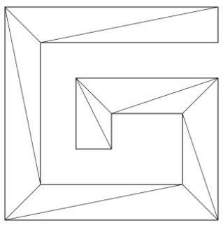
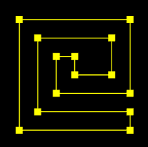
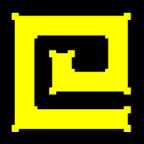

## 基本步骤

我使用的方法叫做“砍角”，其原理就是从起点将多边形中符合特定条件的角逐个砍掉，然后保存到一个集合里，直到把多边形砍得只剩下一个三角形为止。这时候集合里的所有三角形就是我们想要的独立三角形。

举个例子：


已知：逆时针绘图的路径 G

求：将其变成下方网格的方法



解：

1. 寻找满足以下条件的 ▲ABC：

- ▲ABC 的顶点索引位置连续，如 012,123、234
- 点 C 在向量 AB 的正开半平面里，可以理解为你站在 A 点，面朝 B 点，点 C 要在你的左手边
- ▲ABC 中没有包含路径 G 中的其它顶点

2. 当找到 ▲ABC 后，就将点 B 从路径的顶点集合中删掉，然后继续往后找。

3. 当路径的定点集合只剩下 3 个点时，就结束。

4. 由所有满足条件的 ▲ABC 构成的集合就是我们要求的独立三角形集合。

## 绘制路径 G

1. 路径 G 的顶点数据

```js
const pathData = [
	0, 0, 600, 0, 600, 100, 100, 100, 100, 500, 500, 500, 500, 300, 300, 300, 300, 400, 200, 400, 200,
	200, 600, 200, 600, 600, 0, 600,
]
```

在 pathData 里两个数字为一组，分别代表顶点的ｘ位和ｙ位。

在实际项目协作中，UI 给我们的 svg 文件可能也是以像素为单位画出来的，我们需要转换为 webgl 画布中，需要做数据映射。

2. 在 webgl 中绘制正方形。

从 pathData 数据中我们可以看出，路径 G 的宽高都是 600，是一个正方形。

所以，我可以将路径 G 映射到 webgl 画布的一个正方形中。

这个正方形的高度我可以暂且定为 1，那么其宽度就应该是高度除以 canvas 画布的宽高比。

```js
//宽高比
const ratio = canvas.width / canvas.height
//正方形高度
const rectH = 1.0
//正方形宽度
const rectW = rectH / ratio
```

3. 正方形的定位，把正方形放在 webgl 画布的中心。

获取正方形尺寸的一半，然后求出其 x、y 方向的两个极值即可。

```js
//正方形宽高的一半
const [halfRectW, halfRectH] = [rectW / 2, rectH / 2]
//两个极点
const minX = -halfRectW
const minY = -halfRectH
const maxX = halfRectW
const maxY = halfRectH
```

4. 利用之前的 Poly 对象绘制正方形，测试一下效果。

```js
const rect = new Poly({
	gl,
	vertices: [minX, maxY, minX, minY, maxX, minY, maxX, maxY],
})
rect.draw()
```


先画了 4 个点，效果没问题。

5.建立 x 轴和 y 轴比例尺。

```js
const scaleX = ScaleLinear(0, minX, 600, maxX)
const scaleY = ScaleLinear(0, minY, 600, maxY)
function ScaleLinear(ax, ay, bx, by) {
	const delta = {
		x: bx - ax,
		y: by - ay,
	}
	const k = delta.y / delta.x
	const b = ay - ax * k
	return function (x) {
		return k * x + b
	}
}
```

ScaleLinear(ax, ay, bx, by) 方法使用的就是点斜式，用于将 x 轴和 y 轴上的数据像素数据映射成 webgl 数据

- ax 像素数据的极小值
- ay webgl 数据的极小值
- bx 像素数据的极大值
- by webgl 数据的极大值

  6.将路径 G 中的像素数据解析为 webgl 数据

```js
const glData = []
for (let i = 0; i < pathData.length; i += 2) {
	glData.push(scaleX(pathData[i]), scaleY(pathData[i + 1]))
}
```

画一下看看：

```js
const path = new Poly({
	gl,
	vertices: glData,
	types: ['POINTS', 'LINE_LOOP'],
})
path.draw()
```



效果没有问题。

## 将图形网格化

1. 我自己建立了一个 ShapeGeo 对象，用于将图形网格化。

```js
const shapeGeo = new ShapeGeo(glData)
```

属性：

- pathData 平展开的路径数据
- geoData 由路径数据 pathData 转成的对象型数组
- triangles 三角形集合，对象型数组
- vertices 平展开的对立三角形顶点集合

方法：

- update() 更新方法，基于 pathData 生成 vertices
- parsePath() 基于路径数据 pathData 转成对象型数组
- findTriangle(i) 寻找符合条件的三角形

  - i 顶点在 geoData 中的索引位置，表示从哪里开始寻找三角形

- includePoint(triangle) 判断三角形中是否有其它顶点
- inTriangle(p0, triangle) 判断一个顶点是否在三角形中
- cross([p0, p1, p2]) 以 p0 为基点，对二维向量 p0p1、p0p2 做叉乘运算
- upadateVertices() 基于对象数组 geoData 生成平展开的 vertices 数据

> [查看源码](https://github.com/sunsmile-ls/webgl-demo/blob/master/src/jsm/ShapeGeo.ts)

2. 绘制 G 形面

```js
const face = new Poly({
	gl,
	vertices: shapeGeo.vertices,
	types: ['TRIANGLES'],
})
face.draw()
```

效果如下：



