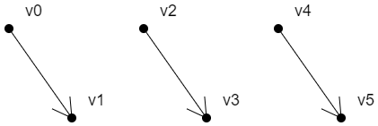

**三角形是一个最简单、最稳定的面，webgl 中的三维模型都是由三角面组成的.**

在 webgl 里所有的图形都是由顶点连接而成的，所以我们先画三个可以构成三角形的点。

## 基本图形

gl.drawArrays(mode,first,count) 方法可以绘制一下图形：

- POINTS 可视的点
- LINES 单独线段
- LINE_STRIP 线条
- LINE_LOOP 闭合线条
- TRIANGLES 单独三角形
- TRIANGLE_STRIP 三角带
- TRIANGLE_FAN 三角扇

上面的 POINTS 比较好理解，就是一个个可视的点。

线和面的绘制方式各有三种，咱们接下来就详细说一下。

#### 2-1-点的绘制

POINTS 可视的点


上面六个点的绘制顺序是：v0, v1, v2, v3, v4, v5

#### 2-2-线的绘制

1. LINES 单独线段



​ 上面三条有向线段的绘制顺序是：

​ v0>v1

​ v2>v3

​ v4>v5

2. LINE_STRIP 线条


​ 上面线条的绘制顺序是：v0>v1>v2>v3>v4>v5

3. LINE_LOOP 闭合线条


​ 上面线条的绘制顺序是：v0>v1>v2>v3>v4>v5>v0

#### 2-3-面的绘制

对于面的绘制，我们首先要知道一个原理：

- 面有正反两面。
- 面向我们的面，如果是正面，那它必然是逆时针绘制的；
- 面向我们的面，如果是反面，那它必然是顺时针绘制的；

接下来，咱们看一下面的三种绘制方式：

1. TRIANGLES 单独三角形


​ 上面两个面的绘制顺序是：

​ v0>v1>v2

​ v3>v4>v5

2. TRIANGLE_STRIP 三角带


上面四个面的绘制顺序是：

1. v0>v1>v2

2. v2>v1>v3

3. v2>v3>v4

4. v4>v3>v5

- 规律

  - **第偶数个三角形**：以上一个三角形的第二条边+下一个点为基础，以和第二条边相反的方向绘制三角形

  - **第奇数个三角形**：以上一个三角形的第三条边+下一个点为基础，以和第三条边相反的方向绘制三角形

3. TRIANGLE_FAN 三角扇


上面四个面的绘制顺序是：

​ 1. v0>v1>v2

​ 2. v0>v2>v3

​ 3. v0>v3>v4

​ 4. v0>v4>v5

- 规律

  以上一个三角形的第三条边+下一个点为基础，按照和第三条边相反的顺序，绘制三角形

## 绘制多点

1. 建立着色器源文件

```html　
<script id="vertexShader" type="x-shader/x-vertex">
    attribute vec4 a_Position;
    void main(){
        gl_Position = a_Position;
        gl_PointSize = 20.0;
    }
</script>
<script id="fragmentShader" type="x-shader/x-fragment">
    void main(){
        gl_FragColor=vec4(1.0,1.0,0.0,1.0);
    }
</script>
```

2. 获取 webgl 上下文

```js
const canvas = document.getElementById('canvas');
canvas.width = window.innerWidth;
canvas.height = window.innerHeight;
const gl = canvas.getContext('webgl');
```

3. 初始化着色器

```js
const vsSource = document.getElementById('vertexShader').innerText;
const fsSource = document.getElementById('fragmentShader').innerText;
initShaders(gl, vsSource, fsSource);
```

4. 设置顶点点位

```js
// 创建顶点数据，两个浮点数构成一个顶点，分别代表x、y 值
const points = [0, 0.2];

// 上面数据是js缓存中，着色器获取不到，需要通过公共的缓存对象转换
const vertexBuffer = gl.createBuffer();

// 绑定缓存对象
gl.bindBuffer(gl.ARRAY_BUFFER, vertexBuffer);

// 往缓冲区对象中写入数据
gl.bufferData(gl.ARRAY_BUFFER, new Float32Array(points), gl.STATIC_DRAW);

// 将缓冲区对象分配给 attribute 变量
const a_Position = gl.getAttribLocation(gl.program, 'a_Position');
gl.vertexAttribPointer(a_Position, 2, gl.FLOAT, false, 0, 0);

// 开启顶点数据的批处理功能
gl.enableVertexAttribArray(a_Position);
```

- **gl.bindBuffer(target,buffer)** 绑定缓冲区

  - target 要把缓冲区放在 webgl 系统中的什么位置
  - buffer 缓冲区

  着色器对象在执行 initShaders() 初始化方法的时候，已经被写入 webgl 上下文对象 gl 中了。

- **gl.bufferData(target, data, usage)** 将数据写入缓冲区

  - target 要把缓冲区放在 webgl 系统中的什么位置
  - data 数据
  - usage 向缓冲区写入数据的方式，咱们在这里先知道 gl.STATIC_DRAW 方式即可，它是向缓冲区中一次性写入数据，着色器会绘制多次。

- **gl.vertexAttribPointer(local,size,type,normalized,stride,offset)** 将缓冲区对象分配给 attribute 变量

  - local attribute 变量
  - size 顶点分量的个数，比如我们的 vertices 数组中，两个数据表示一个顶点，那咱们就写 2
  - type 数据类型，比如 gl.FLOAT 浮点型
  - normalized 是否将顶点数据归一
  - stride 相邻两个顶点间的字节数，我的例子里写的是 0，那就是顶点之间是紧挨着的
  - offset 从缓冲区的什么位置开始存储变量，我的例子里写的是 0，那就是从头开始存储变量

5. 清理画布

```js
gl.clearColor(0.0, 0.0, 0.0, 1.0);
gl.clear(gl.COLOR_BUFFER_BIT);
```

6. 绘图

```js
gl.drawArrays(gl.POINTS, 0, 1);
```

- drawArrays(mode,first,count)

  - mode 绘图模式，比如 gl.POINTS 画点
  - first 从哪个顶点开始绘制
  - count 要画多少个顶点

7. **异步绘制** 一秒钟后，向顶点数据中再添加的一个顶点，修改缓冲区数据，然后清理画布，绘制顶点

```js
setTimeout(() => {
	points.push(-0.2, -0.1);
	gl.bufferData(gl.ARRAY_BUFFER, new Float32Array(points), gl.STATIC_DRAW);
	gl.clear(gl.COLOR_BUFFER_BIT);
	gl.drawArrays(gl.POINTS, 0, 2);
}, 1000);
```

8.  **异步绘制** 两秒钟后，清理画布，绘制顶点，绘制线条

```js
setTimeout(() => {
	gl.clear(gl.COLOR_BUFFER_BIT);
	gl.drawArrays(gl.POINTS, 0, 2);
	gl.drawArrays(gl.LINE_STRIP, 0, 2);
}, 2000);
```

## 封装多边形对象

建立一个 Poly 对象，这个对象是辅助我们理解这一篇的知识的，没做太深层次的考量，因为有的知识点我们还没有讲到。

```js
const defAttr = () => ({
	gl: null, // webgl 上下文对象
	/**
    * vertices 顶点数据集合，在被赋值的时候会做两件事
      - 更新 count 顶点数量，数据运算尽量不放渲染方法里
      - 向缓冲区内写入顶点数据
    */
	vertices: [],
	geoData: [], // 模型数据，对象数组，可解析出 vertices 顶点数据
	size: 2, // 顶点分量的数目
	attrName: 'a_Position', // 代表顶点位置的 attribute 变量名
	count: 0, //  顶点数量
	types: ['POINTS'], // 绘图方式，可以用多种方式绘图
});
export default class Poly {
	constructor(attr) {
		Object.assign(this, defAttr(), attr);
		this.init();
	}
	// 初始化方法，建立缓冲对象，并将其绑定到 webgl 上下文对象上，然后向其中写入顶点数据。
	// 将缓存区对象分配给attribute变量，并开启 attribute 变量的批处理功能。
	init() {
		const { attrName, size, gl } = this;
		if (!gl) {
			return;
		}
		const vertexBuffer = gl.createBuffer();
		gl.bindBuffer(gl.ARRAY_BUFFER, vertexBuffer);
		this.updateBuffer();
		const a_Position = gl.getAttribLocation(gl.program, attrName);
		gl.vertexAttribPointer(a_Position, size, gl.FLOAT, false, 0, 0);
		gl.enableVertexAttribArray(a_Position);
	}
	// 添加顶点
	addVertice(...params) {
		this.vertices.push(...params);
		this.updateBuffer();
	}
	// 删除最后一个顶点
	popVertice() {
		const { vertices, size } = this;
		const len = vertices.length;
		vertices.splice(len - size, len);
		this.updateCount();
	}
	// 根据索引位置设置顶点
	setVertice(ind, ...params) {
		const { vertices, size } = this;
		const i = ind * size;
		params.forEach((param, paramInd) => {
			vertices[i + paramInd] = param;
		});
	}
	// 更新缓冲区数据，同时更新顶点数量
	updateBuffer() {
		const { gl, vertices } = this;
		this.updateCount();
		gl.bufferData(gl.ARRAY_BUFFER, new Float32Array(vertices), gl.STATIC_DRAW);
	}
	// 更新顶点数量
	updateCount() {
		this.count = this.vertices.length / this.size;
	}
	// 基于 geoData 解析出 vetices 数据
	updateVertices(params) {
		const { geoData } = this;
		const vertices = [];
		geoData.forEach(data => {
			params.forEach(key => {
				vertices.push(data[key]);
			});
		});
		this.vertices = vertices;
	}
	// 绘图方法
	draw(types = this.types) {
		const { gl, count } = this;
		for (let type of types) {
			gl.drawArrays(gl[type], 0, count);
		}
	}
}
```

接下来就可以用 Poly 对象实现之前的案例了。

```js
const poly = new Poly({
	gl,
	vertices: [0, 0.2],
});
poly.draw(['POINTS']);

setTimeout(() => {
	poly.addVertice(-0.2, -0.1);
	gl.clear(gl.COLOR_BUFFER_BIT);
	poly.draw(['POINTS']);
}, 1000);

setTimeout(() => {
	gl.clear(gl.COLOR_BUFFER_BIT);
	poly.draw(['POINTS', 'LINE_STRIP']);
}, 2000);
```

异步绘图原理跑通了，我们也就可以用鼠标绘制线条了。

```js
//实例化多边形
const poly = new Poly({
	gl,
	types: ['POINTS', 'LINE_STRIP'],
});

// 鼠标点击事件
canvas.addEventListener('click', event => {
	const { x, y } = getMousePosInWebgl(event, canvas);
	poly.addVertice(x, y);
	gl.clear(gl.COLOR_BUFFER_BIT);
	poly.draw();
});
```

