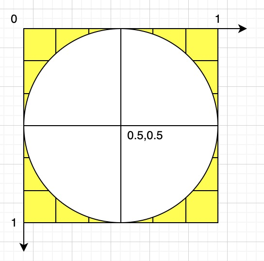

**前面我们已经可以控制顶点的位置和大小，这讲我们在这个基础上绘制闪动的星星**

- 任务分析

由于星星是闪烁的，并且是圆的。所以我们的目标: 1.修改颜色；2.圆；3.闪烁

## 修改颜色

1. 在片元着色器里把控制顶点颜色的变量暴露出来。

```js
<script id="fragmentShader" type="x-shader/x-fragment">
    precision mediump float;
    uniform vec4 u_FragColor;
    void main() {
        gl_FragColor = u_FragColor;
    }
</script>
```

!> precision mediump float 是对浮点数精度的定义，mediump 是中等精度的意思，这个必须要有，不然画不出东西来。

- `uniform`: 为限定符，类似于 es6 中的`export`,表示导出的是颜色相关的变量；
- `vec4`: 是 4 维的变量类型。
- `u_FragColor`: 变量名。

2. 在 js 中获取片元着色器暴露出的 uniform 变量

```js
const u_FragColor = gl.getUniformLocation(gl.program, 'u_FragColor');
```

`getUniformLocation()` 方法就是用于获取片元着色器暴露出的 uniform 变量的，其第一个参数是程序对象，第二个参数是变量名。这里的参数结构和获取 attribute 变量的 `getAttributeLocation()` 方法是一样的。

3. 修改 uniform 变量

```js
gl.uniform4f(u_FragColor, 1.0, 1.0, 0.0, 1.0);
```

#### 扩展 uniform4fv() 方法

改变 uniform 变量，既可以用 uniform4f() 方法一个个的写参数，也可以用 uniform4fv() 方法传递类型数组。

- uniform4f 中，4 是有 4 个数据，f 是 float 浮点类型，在我们上面的例子里就是 r、g、b、a 这四个颜色数据。
- uniform4fv 中，4f 的意思和上面一样，v 是 vector 矢量的意思。由之前的 4f 可知，这个向量由 4 个浮点类型的分量构成。

在上面呢的案例中，我们可以知道，在修改 uniform 变量的时候，这两种写法是一样的：

```js
gl.uniform4f(u_FragColor, 1.0, 1.0, 0.0, 1.0);
//等同于
const color = new Float32Array([1.0, 1.0, 0.0, 1.0]);
gl.uniform4fv(u_FragColor, color);
```

uniform4f() 和 uniform4fv() 也有着自己的同族方法，其中的 4 可以变成 1|2|3。

!> uniform4fv() 方法的第二个参数必须是 Float32Array 数组，是一种 32 位的浮点型数组，它在浏览器中的运行效率要比普通的 Array 高很多。

## 绘制圆

```html
<script id="fragmentShader" type="x-shader/x-fragment">
	precision mediump float;
	uniform vec4 u_FragColor;
	void main() {
	    float dist = distance(gl_PointCoord, vec2(0.5, 0.5));
	    if(dist < 0.5) {
	        gl_FragColor = u_FragColor;
	    } else {
	        discard;
	    }
	}
</script>
```

- distance(p1,p2) 计算两个点位的距离
- gl_PointCoord 片元在一个点中的位置，此位置是被归一化的



`gl_PointCoord`中的点是由多个像素点组成，类似于上面的图。有两个轴线，水平和垂直轴线的长度均为 1，在此实现中表示点到中心点的距离。

- discard 丢弃，即不会一个片元进行渲染

## 添加透明度

首先我们可以先给 canvas 一个星空背景

```css
#canvas {
	background: url('./images/sky.jpg');
	background-size: cover;
	background-position: right bottom;
}
```

刷底色的时候给一个透明的底色，这样才能看见 canvas 的 css 背景

```js
gl.clearColor(0, 0, 0, 0);
```

接下来图形的透明度作为变量：

```js
const arr = new Float32Array([0.87, 0.91, 1, a]);
gl.uniform4fv(u_FragColor, arr);
```

**开启片元的颜色合成功能**

```js
gl.enable(gl.BLEND);
```

**设置片元的合成方式**

```js
gl.blendFunc(gl.SRC_ALPHA, gl.ONE_MINUS_SRC_ALPHA);
```

## 补间动画

通过两个关键帧，对一个对象在这两个关键帧之间的状态进行插值计算，从而实现这个对象在两个关键帧间的平滑过渡

1. 建立合成对象

```js
import Track from './Track';
export interface ComposeType {
	parent: ComposeType | null;
	children: Array<Track>;
	add(obj: Track): void;
	update(t: number): void;
}
export default class Compose implements ComposeType {
	parent: ComposeType | null;
	children: Array<Track>;

	constructor() {
		this.parent = null;
		this.children = [];
	}

	add(obj: Track) {
		obj.parent = this as ComposeType;
		this.children.push(obj);
	}

	update(t: number) {
		this.children.forEach(ele => {
			ele.update(t);
		});
	}
}


```

属性

- parent 父对象，合成对象可以相互嵌套
- children 子对象集合，其集合元素可以是时间轨，也可以是合成对象

方法：

- add(obj) 添加子对象方法
- update(t) 基于当前时间更新子对象状态的方法

2. 建立时间轨

```js
export default class Track {
	start: number;
	timeLen: number;
	loop: boolean;
	target: POINT;
	parent: Compose | null;
	keyMap: Map<keyof POINT, [number, number][]>;
	constructor(target: POINT) {
		this.target = target;
		this.parent = null;
		this.start = 0;
		this.timeLen = 5;
		this.loop = false;
		this.keyMap = new Map();
	}

	update(t: number) {
		const { keyMap, timeLen, target, loop } = this;
		let time = t - this.start;
		if (loop) {
			time = time % timeLen;
		}
		keyMap.forEach((fms, key) => {
			const last = fms.length - 1;
			if (time < fms[0][0]) {
				target[key] = fms[0][1];
			} else if (time > fms[last][0]) {
				target[key] = fms[last][1];
			} else {
				target[key] = getValBetweenFms(time, fms, last);
			}
		});
	}
}
```

属性

- target 时间轨上的目标对象
- parent 父对象，只能是合成对象
- start 起始时间，即时间轨的建立时间
- timeLen 时间轨总时长
- loop 是否循环
- keyMap 关键帧集合，结构如下：

```js
[
	[
		'对象属性1',
		[
			[时间1, 属性值], //关键帧
			[时间2, 属性值], //关键帧
		],
	],
];
```

方法

- update(t) 基于当前时间更新目标对象的状态。

  先计算本地时间，即世界时间相对于时间轨起始时间的的时间。

  若时间轨循环播放，则本地时间基于时间轨长度取余。

  遍历关键帧集合：

  - 若本地时间小于第一个关键帧的时间，目标对象的状态等于第一个关键帧的状态
  - 若本地时间大于最后一个关键帧的时间，目标对象的状态等于最后一个关键帧的状态
  - 否则，计算本地时间在左右两个关键帧之间对应的补间状态

3. 获取两个关键帧之间补间状态的方法

```js
function getValBetweenFms(time: number, fms: [number, number][], last: number): number {
	for (let i = 0; i < last; i++) {
		const fm1 = fms[i];
		const fm2 = fms[i + 1];
		if (time >= fm1[0] && time <= fm2[0]) {
			const delta = {
				x: fm2[0] - fm1[0],
				y: fm2[1] - fm1[1],
			};
			const k = delta.y / delta.x;
			const b = fm1[1] - fm1[0] * k;
			return k * time + b;
		}
	}
	return 0;
}
```

- getValBetweenFms(time,fms,last)

  - time 本地时间
  - fms 某个属性的关键帧集合
  - last 最后一个关键帧的索引位置

  其实现思路如下：

  - 遍历所有关键帧
  - 判断当前时间在哪两个关键帧之间
  - 基于这两个关键帧的时间和状态，求点斜式
  - 基于点斜式求本地时间对应的状态

## 闪烁

1. 建立动画相关的对象

```js
const compose = new Compose();
const stars = [];
canvas.addEventListener('click', function (event) {
	const { x, y } = getPosByMouse(event, canvas);
	const a = 1;
	const s = Math.random() * 5 + 2;
	const obj = { x, y, s, a };
	stars.push(obj);

	const track = new Track(obj);
	track.start = new Date();
	track.keyMap = new Map([
		[
			'a',
			[
				[500, a],
				[1000, 0],
				[1500, a],
			],
		],
	]);
	track.timeLen = 2000;
	track.loop = true;
	compose.add(track);
});
```

- compose 合成对象的实例化
- stars 存储顶店数据的集合
- track 时间轨道对象的实例化

2. 用请求动画帧驱动动画，连续更新数据，渲染视图。

```js
function ani() {
	compose.update(new Date().getTime());
	render();
	requestAnimationFrame(ani);
}
ani();
```

渲染方法如下：

```js
function render() {
	gl.clear(gl.COLOR_BUFFER_BIT);
	stars.forEach(({ x, y, s, a }) => {
		gl.vertexAttrib2f(a_Position, x, y);
		gl.vertexAttrib1f(a_PointSize, s);
		gl.uniform4fv(u_FragColor, new Float32Array([0.87, 0.92, 1, a]));
		gl.drawArrays(gl.POINTS, 0, 1);
	});
}
```

