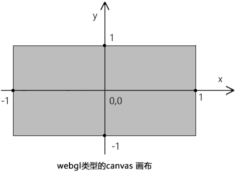

## webgl 是什么？

webgl 是在网页上绘制和渲染三维图形的技术，可以让用户与其进行交互。

## 坐标系

#### canvas 2d

- 坐标系的原点在左上角。
- canvas 2d 坐标系的 y 轴方向是朝下的。


#### webgl

- webgl 坐标系的坐标原点在画布中心。
- webgl 坐标系的 y 轴方向是朝上的。



## canvas 2d 和 webgl 绘图的差异

- 渲染二维图形使用`js`语言。
- 渲染三维图形使用`GLSL ES`语言。

通过上面的说明，`webgl`使用`GLSL ES`语言，那么我们需要把`js`语言转换为`GLSL ES`。

## webgl 的绘图思路

1. 找一台电脑 - 浏览器里内置的 webgl 渲染引擎，负责渲染 webgl 图形，只认 GLSL ES 语言。
2. 找一块手绘板 - 程序对象，承载`GLSL ES`语言，翻译`GLSL ES`语言和`js`语言，使两者可以相互通信。`语言之间互相转化`
3. 找一支触控笔 - 通过 canvas 获取的 webgl 类型的上下文对象，可以向手绘板传递绘图命令，并接收手绘板的状态信息。
4. 开始画画 - 通过 webgl 类型的上下文对象，用 js 画画。

## 快速模版

```html
<!-- 1. s在html中建立canvas 画布  -->
<canvas id="canvas"></canvas>

<!-- 2. 在script中建立顶点着色器和片元着色器，glsl es -->
<!-- 1) 顶点着色器 -->
<script id="vertexShader" type="x-shader/x-vertex">
	void main() {
	    gl_Position = vec4(0.0, 0.0, 0.0, 1.0);
	    gl_PointSize = 100.0;
	}
</script>
<!-- 2) 片元着色器 -->
<script id="fragmentShader" type="x-shader/x-fragment">
	void main() {
	    gl_FragColor = vec4(1.0, 1.0, 0.0, 1.0);
	}
</script>
```

```js
// 3. 在js中获取canvas画布
const canvas = document.getElementById('canvas')

canvas.width = window.innerWidth
canvas.height = window.innerHeight

// 4. 使用canvas 获取webgl 绘图上下文
const gl = canvas.getContext('webgl')

// 5. 获取定点着色器和片源着色器文本
const vsSource = document.getElementById('vertexShader').innerText
const fsSource = document.getElementById('fragmentShader').innerText

// 6. 初始化着色器
initShaders(gl, vsSource, fsSource)

// 7. 指定将要用来清空绘图区的颜色
//    一旦设置了背景色，就会驻留在内存中，再次使用没有必要再指定一次颜色
gl.clearColor(0, 0, 0, 1)

// 8. 使用之前指定的颜色，清空绘图区
gl.clear(gl.COLOR_BUFFER_BIT)

// 9. 绘制顶点
gl.drawArrays(gl.POINTS, 0, 1)
```

#### 盲点剖析

1. `顶点着色器`：描述顶点的特征，如位置、颜色等。程序要写在`type=“x-shader/x-vertex”` 的 script 中。

- `gl_Position` 是顶点的位置，`gl_PointSize` 是顶点的尺寸，这种名称都是固定的，不能写成别的

2. `片元着色器`：进行逐片元处理，如光照。程序要写在`type=“x-shader/x-fragment”` 的 script 中。

- `gl_FragColor` 是片元的颜色。 `vec4()` 是一个 4 维矢量对象

!> 顶点着色器里的顶点就是决定这一条直线的两个点，片元着色器里的片元就是把直线画到画布上后，这两个点之间构成直线的每个像素

3. 初始化着色器

```js
function initShaders(gl, vsSource, fsSource) {
	//创建程序对象
	const program = gl.createProgram()
	//建立着色对象
	// 手绘板里用于接收触控笔信号的零部件，二者可以分工合作，
	// 把触控笔的压感（js信号）解析为计算机语言(GLSL ES)，然后让计算机(浏览器的webgl 渲染引擎)识别显示
	const vertexShader = loadShader(gl, gl.VERTEX_SHADER, vsSource)
	const fragmentShader = loadShader(gl, gl.FRAGMENT_SHADER, fsSource)
	//把顶点着色对象装进程序对象中
	gl.attachShader(program, vertexShader)
	//把片元着色对象装进程序对象中
	gl.attachShader(program, fragmentShader)
	//连接webgl上下文对象和程序对象
	gl.linkProgram(program)
	//启动程序对象
	gl.useProgram(program)
	//将程序对象挂到上下文对象上
	gl.program = program
	return true
}

function loadShader(gl, type, source) {
	//根据着色类型，建立着色器对象
	const shader = gl.createShader(type)
	//将着色器源文件传入着色器对象中
	gl.shaderSource(shader, source)
	//编译着色器对象
	gl.compileShader(shader)
	//返回着色器对象
	return shader
}
```

